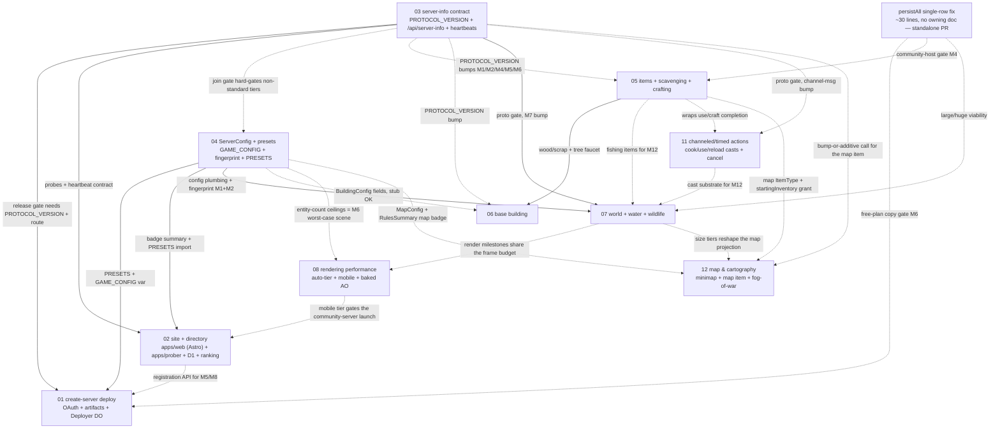

# Worldspring — Plans Roadmap

Read this first. It is the map for the seven design docs in this directory: what each
owns, what gates what, the order to build in, and the decisions still waiting on Adam.
`ARCHITECTURE.md` at the repo root remains the binding contract for the codebase; these
docs amend it explicitly where they must, and several milestones ship the amendment in
the same PR as the code.

## Vision

Worldspring is an open-source, browser-native DayZ-like: a low-poly procedural island,
zombies, hunger and cold, full-loot PvP — running as a React Three Fiber client against
an authoritative Durable Object server with a shared deterministic sim. No launcher, no
install. The repo deploys with one command, and the deterministic worldgen contract
(seeded rng streams, identical on client and server) is what keeps a 34 KB worker and a
browser tab agreeing about every wall and tree.

The platform bet: anyone can run their own server on their own Cloudflare account — for
$0–$5/month — without touching a terminal. Doc 01 turns "Create Server" into an OAuth
bounce plus a replayed CI-built artifact landing in *their* account; docs 02/03 give
every server a public, versioned identity (`/api/server-info`, heartbeats) and a
directory that ranks honestly and never pretends to verify code it cannot see. The CLI
path (`git clone && npm run deploy`) stays first-class forever; the site flow is sugar.

Presets are what make this more than a clone. Doc 04's `ServerConfig` makes "no zombies
on my server", permanent night, hardcore scarcity, or a PvP war server a deploy-time
choice, not a fork — and docs 05/06/07 grow the game itself: a real scavenge→craft→gear
arc, bases that persist and get raided, bigger islands with rivers, wolves, and fishing.
A directory full of servers with *personalities* is the product.

## Status re-baseline — 2026-07-14

**This is the current truth; it supersedes the 2026-07-07 section below (kept for
provenance).** In the week since that re-baseline the platform track — which 07-07
called "stalled at Wave 0" — largely *closed*, and the product's north star moved.

**North star moved (doc 00, 2026-07-13):** Worldspring is now framed as an
**agent-moddable platform** — fork it, point a coding agent at the fork, deploy the
result to your own Cloudflare; survival is the flagship game and first `GameMode`,
not the ceiling. Read [00-agent-moddable-platform](00-agent-moddable-platform.md)
first — it reframes every numbered doc below it. Determinism is the trust layer;
the directory listing is the one canonical external contract.

**Platform / distribution — the loop closed:**
- **Create-server = a Deploy-to-Cloudflare button** (#120), live on
  `worldspring.games/host`. It **replaces doc 01's OAuth + Deployer-DO arc** (M4–M8):
  one click clones the repo into the visitor's GitHub and provisions the DO in
  *their* account, so they get a fork they own that auto-redeploys on push. Doc 01's
  M1 spike, M2 release pipeline (#59), and M4 OAuth skeleton (#72) shipped along the
  way; M4–M8 are marked SUPERSEDED in that doc. **Open:** the pnpm-monorepo build
  under Workers Builds is not yet validated against a virgin account.
- **The directory is real** (docs 02/03): registration, heartbeat sender, intake,
  prober, browse, ranking, detail, join interstitial, reports, moderation (#68, #75,
  #80). `/servers` is no longer empty.
- **Modder guardrails:** `mod:check` (#115), the asset-size fingerprint (#118), and
  wrangler-parity (#120) — determinism + protocol + config-drift, all gated in CI.

**Engine ⟷ game seam (doc 00 first-moves):** survival re-expressed as a `GameMode`
that owns per-tick composition, world seeding, and the player lifecycle (#105, #110,
#111, #112); **arena** shipped as the first non-survival mode + few-shot template
(#114). Not a package split — an internal legibility boundary, deferred until a real
need for shared updates.

**Gameplay — the parked big-builds all landed:**
- doc 06 base-building: core loop → doors, code locks, storage crates, raiding,
  decay (#77, #79, #83).
- doc 07 world: size tiers, chunked terrain, rivers & ponds (#74, #78, #84).
- doc 13 shared physics (a new track): server-auth substrate → falling trees →
  props → **vehicles** (#61, #64, #67, #81, #82).
- Tree lifecycle: planting, growth, seeds, chopping, stumps, breakable trunks,
  variants (#86, #87, #93). doc 05 M6 wear slots (#73). doc 11 M3 reload (#70).
- **The launch gate is met:** doc 08 M2–M3 device auto-tier + mobile render tier
  (#69), plus the full render-perf audit (Tier-1 frame wins through pooling, chunked
  culling, join-hitch fixes).

**Design + client:** the storefront and Starlight docs reskinned onto the shared
"field-manual" system (#103, #104); the game HUD reskinned to the **Field Kit**
language with a per-mode HUD seam and a real-browser **Playwright e2e harness**
(#119, and see [design/field-kit.md](design/field-kit.md)). Two days-old render bugs
fixed: the night-join blackout (#117) and GLB-transform/trim scaling (#116).

**What's actually next (open):**
- Validate the Deploy button against a live Cloudflare account (the one unverified
  step in the fork loop) + the human visual-QA pass on the Field Kit reskin.
- Harden + version the directory contract (doc 00 item 4 / doc 03) — the one
  canonical external surface.
- **Cloudflare Artifacts** as the future fork-storage layer — track, don't build
  until GA (doc 00).
- Remaining gameplay: pathfinding ([doc 14](14-navmesh-pathfinding.md) — navcat spike + M0
  workerd GO; M1 NavSystem substrate **built** 2026-07-15; M2 zombie chase next), wildlife
  expansion (doc 07 back half), scavenging tails & balance (doc 05).

## Status re-baseline — 2026-07-07

> **Superseded by the 2026-07-14 section above.** Kept for provenance.

One month in, the wave plan below (§Recommended build order) ran **asymmetrically**:
the gameplay track sprinted two waves ahead while the platform track stalled at
Wave 0's last item. This section is the current truth and supersedes the original
ordering; the wave sections below are kept for provenance and milestone detail.

**Done:** doc 03 M1–M2 (PROTOCOL_VERSION — now 5 — + `/api/server-info`); doc 04
M1–M4 (config/presets live in prod); persistAll single-row fix; doc 09 monorepo;
doc 10 preview testbed + QA; doc 12 complete (map/minimap/fog); doc 05 M1–M3
(items/crafting/containers); doc 11 M1–M2 (channel primitive + cast bar); doc 08
M1 (profiler only). **Platform surface landed opportunistically:** worldspring.games
is live on `apps/web` (doc 01 open Q1 resolved — see that doc), the directory D1
exists, and `play.worldspring.games` serves the official game worker.

**Not started:** doc 01 M1 spike (the Wave 0 survivor — still gates all platform
implementation detail), doc 01 M2+, doc 02 M2+ (registration/heartbeat/prober/
browse), doc 03 M3 heartbeat sender, doc 06, doc 07, doc 08 M2+.

**Unmodeled tracks that emerged** (real, recurring, keep them resourced): the
asset pipeline (Blender export + Meshy→GLB registry), and playtester-driven
features (the red realm shipped because a young playtester asked — this track
validates the product and gets a standing slot).

### Wave 1.5 — the current plan (decided 2026-07-07)

**Platform spine** (sequential): doc 01 **M1 spike** → doc 01 **M2 release
pipeline** (`v*` tags; makes `/api/v1/latest` real) → doc 03 **M3 heartbeat
sender** → doc 02 **M2–M5 directory core** (registration, ingest, prober,
browse — the official server gets listed and `/servers` stops being empty) →
then doc 01 M4–M5 (OAuth + Deployer DO).
**Ordering flip vs. the original plan:** doc 02's directory now lands *before*
doc 01's create-flow build — the site is live and needs to be real, and doc 01
M5 consumes doc 02's registration API anyway.

**Gameplay cadence** (parallel): ONE contained milestone per week — doc 05
M4/M5 tails, doc 11 M3 (reload/magazine), or a playtester request. Docs 06/07
big builds stay parked until the platform loop closes.

**Launch gate, made explicit:** doc 08 M2–M3 (auto-tier + mobile) is scheduled
the moment the directory is live, and gates any public announcement. It does
not wait for "Wave 3".

**Amendment 2026-07-07 — shared dynamic physics (doc 13).** Adam wants falling
trees, physics props, and vehicles. [Doc 13](13-shared-dynamic-physics.md) adds
the substrate: a WASM engine (Rapier now, Box3D tracked) stepped
server-authoritatively, clients interpolate — the kinematic player and
`movement.ts` are untouched. Sequencing: doc 13 **M0** (determinism + cost
spike, GO/NO-GO) runs as a weekly slice; if it passes, doc 13 **M1 substrate**
becomes the anchored Wave 2 big build; **doc 07 M1–M2 moves ahead of vehicles**
(M4 needs the bigger islands) and doc 06 slides behind or parallel — bases stay
static colliders either way. The scaling roadmap's spatial-index/30 Hz calls
are now made physics-aware.

## Doc index

| Doc | One line |
| --- | --- |
| [01-create-server-deploy.md](01-create-server-deploy.md) | One-click deploy into the user's own Cloudflare account: confidential OAuth client, CI release artifacts in R2, a Deployer DO replaying the multipart Script Upload API, ephemeral tokens, update/delete flows. |
| [02-server-directory.md](02-server-directory.md) | Official site + server directory: Astro app `apps/web` (landing + Starlight docs + directory SSR over D1) plus a standalone `apps/prober` cron Worker, `dcd1.` server tokens + challenge-hash URL proof, probe-first liveness, capped Luanti-style ranking, honest leave-our-site join interstitial. |
| [03-server-info-contract.md](03-server-info-contract.md) | The contract everything builds on: `PROTOCOL_VERSION` + two-sided `proto` join gate, versioned `GET /api/server-info` (DO cheap-read + Worker micro-cache), push-primary heartbeats, forward-compat rules. |
| [04-gameplay-presets.md](04-gameplay-presets.md) | `ServerConfig` in `packages/shared/src/config.ts`: constants stay defaults, config multiplies at point of use, `GAME_CONFIG` var → fail-closed `world_fingerprint` wipes, six presets, whole-config-in-welcome, admin v1. |
| [05-items-scavenging-crafting.md](05-items-scavenging-crafting.md) | Minutes 10–120: 16 new data-driven items, searchable containers on a new hash-salted rng stream, tree gather nodes, deer corpses + knife harvest, flat `RECIPES` crafting, jacket/backpack wear slots. |
| [06-base-building.md](06-base-building.md) | Base building v1: mutable shared `StructureIndex` merged into the statics queries (zero movement.ts changes), snap-to-grid `canPlace`, global `sFull`/`sAdd` deltas, single-blob persistence, code locks, melee raiding, decay. |
| [07-world-and-wildlife.md](07-world-and-wildlife.md) | World expansion: standard/large/huge tiers, chunked LOD terrain (fog-bounded), carve-in-heightfield rivers/ponds + wading + fishing, Deer→Animal species framework (rabbit/boar/wolf packs), fingerprint harness CI gate. |
| [08-rendering-performance.md](08-rendering-performance.md) | Measured frame budget (the scene is post/fill-bound, not geometry-bound): device/GPU auto-tier + a real mobile tier (the launch gate), baked static-world vertex AO to kill the ~46%-of-frame N8AO line, shadow/rig budgets, WebGPU scoped as blocked R&D. |
| [09-monorepo-migration.md](09-monorepo-migration.md) | **Infrastructure, do first:** pnpm workspace + Turborepo → `apps/game` (Vite, identity preserved), `apps/web` (Astro + Starlight + directory SSR/D1 — supersedes doc 02's Hono), `apps/prober` (cron Worker), `packages/shared` (`@worldspring/shared`, determinism-gated extraction). Lands before any feature milestone. |
| [10-preview-testbed-qa.md](10-preview-testbed-qa.md) | **Infrastructure / process:** makes the per-PR `worldspring-pr-<N>` preview *testable* — a prod-gated (`env.TESTBED`, never in `wrangler.jsonc`) `provisionTestbed` that lands a fresh-token join fully kitted at a coast station by a lit fire through existing systems (no new wire surface), an extensible typed `Scenario` schema (`parseScenario` in `packages/shared`) driving both that setup and a headless `@worldspring/testkit` harness, and a `/testbed` Claude Code skill that authors scenarios + the human checklist from a diff. The QA acceptance harness docs 05/06/07 defer to. |
| [11-channeled-timed-actions.md](11-channeled-timed-actions.md) | The channeled-action primitive: a shared `ActiveAction` on `ServerPlayer` (durationS + cancel-on-move/damage/slot-swap/leave-fire), zero new ClientMsg (server-driven cancel) + an additive `you.action` snapshot/`welcome` field + a HUD cast bar, server-authoritative game-time countdown that fires the existing completion path (cook/boil, use, craft, reload, deer-harvest, fishing cast) on finish — turning doc 05's instant `use`/`craft` and combat's instant ranged fire into interruptible casts (forcing the net-new reload + magazine model), with one `PROTOCOL_VERSION` bump owned by doc 03. |
| [12-map-and-cartography.md](12-map-and-cartography.md) | In-game map + minimap + offline `pnpm map:render`, all from a shared three.js-free raster core over the deterministic `createWorld(seed)` (zero new wire for a full map); a `MapConfig` server dial (minimap on/off, map item `spawn`/`loot`/`none`, reveal `full`/`explored`) + a `map` `ItemType`; and server-authoritative, persisted **fog-of-war** (per-character `ExploredGrid`, additive `CharacterState` JSON + additive `welcome`/`snap` wire) for the `explored` mode — honest that fog can't hide terrain (public seed). |
| [13-shared-dynamic-physics.md](13-shared-dynamic-physics.md) | Shared rigid-body dynamics on a deterministic WASM engine (Rapier now, Box3D tracked): server-auth stepping in the DO tick + client interpolation (players stay kinematic, `movement.ts` untouched), `WireBody` snapshot sync, bodies in the world snapshot, CI replay harness; features in tracer order — falling trees → props → vehicles (after doc 07 tiers). M0 is a determinism+cost GO/NO-GO spike. |
| [14-navmesh-pathfinding.md](14-navmesh-pathfinding.md) | Server-side navmesh pathfinding (navcat, pure-JS) so zombies/wildlife route around obstacles instead of straight-line aggro: an engine-owned `NavSystem` behind a swappable `Pathfinder` seam, built from the same worldgen heightfield + static AABBs the sim collides with, tiled + activity-scoped + never persisted/fingerprinted/client-shared (zero wire change — clients still interpolate positions). Fixes doc 06's three-wall base-immunity cheese. M0 is a workerd-execution GO/NO-GO gate on the existing GO-with-conditions spike (`spike/navcat`). |
| `research/` | Ground truth the docs cite: `cf-costs.md` (billing math — read this one regardless), `cf-deploy.md`, `cf-oauth.md`, `codebase-server.md`, `codebase-sim.md`, `directory-prior-art.md`. |

### Canonical vocabulary (who owns what)

Parallel-written docs share these names; the owner's definition is binding:

| Thing | Owner | Notes |
| --- | --- | --- |
| `PROTOCOL_VERSION`, `join.proto` / `welcome.proto` two-sided gate | doc 03 | The wire field is `proto`. Bump rule: breaking msg shapes/semantics, predicted sim behavior (`movement.ts`/`world.ts`), or `ItemType` wire-enum growth. |
| `ServerInfo`, `RulesSummary` (type), `HeartbeatBody`, heartbeat sender, `/api/server-info` serving design | doc 03 | DO cheap-read behind a 15s per-isolate Worker micro-cache — deliberate, do not "optimize" to pure-Worker serving (live fields need the DO). |
| `ServerConfig`, `PRESETS`, `GAME_CONFIG` var, `resolveServerConfig`/`clampConfig`, `summarizeRules` derivation, `world_fingerprint` | doc 04 | Doc 03 M2 ships a stub `config.ts`; doc 04 M1 replaces it. |
| Server token `dcd1.<serverId>.<secretHex>`, challenge hash, registration, `POST /api/v1/heartbeat` intake | doc 02 | Doc 03's sender POSTs to doc 02's versioned route with the bearer token. |
| `wood`/`scrap` items, tree-gather faucet, fishing/canteen items | doc 05 | Doc 06 consumes them verbatim; doc 07 M12 replaces only doc 05's *interim fishing mechanic*, never the items. |
| `cOpen`/`cMove`/`cont` container protocol, `hammer`, `BuildingConfig` semantics | doc 06 | Doc 04 §1 carries the amended `BuildingConfig {enabled, pieceCapPerPlayer, decayHours, offlineRaidMult}`. |
| `WorldSizeTier` value set (standard/large/huge), tier tables, `waterAt`, `WORLDGEN_VERSION`, species framework | doc 07 | Doc 04's M6 tier work is **subsumed by doc 07 M1–M2** — implement once, through doc 07. |
| Client render tiers: `QualityConfig` knobs, `detectTier`, `mobile` profile, baked-AO vertex pass, the `?debug=1` frame profiler | doc 08 | Doc 04's presets dial *server* entity counts; doc 08 owns *client* render quality. The two meet only at doc 08 M6's worst-case test scene (doc 04 `zombieDensity:2` + doc 07 species ceilings). |
| `ActiveAction` (the channeled-action primitive), the server-driven cast + cancel rules, the `you.action` snapshot/`welcome` field, `*_CHANNEL_S` durations | doc 11 | docs 05 (use/craft), combat (reload/magazine), 07 (fishing cast) delegate their completion to it but keep their own data + balance. |
| `MapConfig` group, the `map` `ItemType`, the `ExploredGrid` fog primitive (+ `FOG_CELL_M`), the shared `packages/shared/src/map/` raster core | doc 12 | Extends doc 04's `ServerConfig` (LIVE-class, never in `worldFingerprintOf`), doc 05's items + `LOOT_TABLES` + `startingInventory` grant, doc 03's `RulesSummary` badge; the `explored` wire fields are additive-optional; the bump-vs-additive call for the `map` item is doc 03's (doc 12 Open Q1). |
| The `Pathfinder` seam + engine-owned `NavSystem`, the server-side navmesh, `dirtyTile`/`stepBuild`, `navTileCap`/`NAV_BUILD_BUDGET_MS`, the three walkability reconciliations (water/slope/vertical) | doc 14 | Server-private derived data — never persisted, fingerprinted, or client-shared (AI is outside the determinism contract); consumes doc 06's `StructureIndex` + doc 05's planted trees as dirty-tile triggers and PhysicsSystem's `PhysicsStaticsSource`; consumed by zombie/wildlife AI via the `stepZombie` target only (no wire change); LIVE-class on/off dial. |

## Dependency graph

Solid arrows are hard dependencies; dotted arrows are gates on specific milestones
(stub-able or sequencing-only). The two chokepoints are **doc 03 M1–M2** and **doc 04
M1–M2**: between them they gate doc 01's release artifacts, doc 02's entire contract
surface, doc 07's M1, and the version-gate story every gameplay doc leans on. The
gameplay docs (05/06/07) are otherwise **independent of the platform docs (01/02)** —
the game can grow while the hosting story is built in parallel. **Doc 08 has no hard
dependency** — it is client render code that can start any time; its only couplings are
soft (its acceptance scenes use doc 04/07 ceilings, and its mobile tier gates a credible
public launch).

## Client frame budget (the binding render anchor)

Every gameplay doc that adds something to the screen is spending against a measured
budget, and that budget does **not** live where the docs assume. Profiled on an M3 Max /
ProMotion display, in-town, `high` tier (doc 08 has the full table): the frame costs
**~24 ms and is post/fill/CPU-bound** — N8AO ambient occlusion alone is **~11 ms (~46 %
of the frame)**, shadows ~2.6 ms, `dpr`-2 fill is most of the rest; **draw calls and
triangles together measured < 1 ms.** Three rules fall out, binding on docs 04/06/07:

1. **Acceptance criteria measure frame-time and main-thread-ms, not draw counts.** Doc
   07's chunked terrain ("~32K verts, ≤45 draws") and doc 06's instancing ("≤14 draws")
   are correctly *optimizing a non-bottleneck on desktop* — keep them (they matter for
   mobile and upload spikes), but gate them on measured **frame ms** plus a **mid-tier
   device** check, not draw/triangle counts.
2. **Main-thread rig updates are the one shared budget line.** Doc 04 (`zombieDensity:2` =
   120 zombies), doc 07 (up to 256 animals), and doc 06 (per-delta matrix rewrites) all
   draw on it. It is masked under GPU-bound frames on an M3 Max but surfaces on weaker
   GPUs — doc 08 M6 owns bounding it, with those ceilings as the worst-case test scene.
3. **No client device/GPU auto-detect exists** (`settings.ts` hardcodes `quality:"high"`)
   — every phone boots dpr-2 + full-res AO. This is a **launch-blocking gap** for the
   "anyone joins any server" pitch, owned by doc 08 M2–M3.

Doc 08 is measurement-gated and **off the critical path** — it ships behind the spine, but
the gameplay docs must write their perf acceptance criteria in this vocabulary.

## Recommended build order

Model guidance is pulled from each doc's own milestone annotations: **Opus 4.8** for
determinism-, protocol-, persistence-, and security-sensitive milestones; **Sonnet 4.8**
for mechanical/table-driven/UI work. One milestone per session.

### Wave 0 — the spine (3–4 parallel sessions)

Everything else fans out from here.

1. **Doc 03 M1–M2** — version constants, two-sided `proto` gate, `ServerInfo` +
   `GET /api/server-info`, micro-cache. *(M1 Opus 4.8 — protocol; M2 Sonnet 4.8.)*
2. **Doc 04 M1–M2** — `packages/shared/src/config.ts`, presets, validation, fail-closed
   fingerprint persistence, the repo's first test harness (vitest). *(Both Opus 4.8 —
   determinism + data-loss-adjacent wipe semantics.)*
3. **persistAll single-row world snapshot** (research/cf-costs.md §6 lever 1) — ~30
   lines, no owning doc, gates free-plan marketing (01 M6), community-host builds
   (05 M4), and large/huge viability (07). *(Opus 4.8 — save-path atomicity.)*
4. **Doc 01 M1 spike** — scratch-account OAuth/deploy-API spike; zero repo deps; burns
   down six UNCONFIRMED platform behaviors plus `keep_bindings` semantics and the
   Workers-Logs measurement. *(Sonnet 4.8.)*

### Wave 1 — fan-out (two independent tracks)

**Platform track** (needs Wave 0 items 1–2; sequential within, parallel to gameplay):

5. **Doc 03 M3–M5** — heartbeat sender (+2h soak), colo spike, consumer doc.
   *(Sonnet 4.8.)*
6. **Doc 02 M2→M7** — site scaffold, registration/verification/heartbeat ingest,
   prober, browse/ranking, join interstitial, moderation. *(M3 Opus 4.8 — the trust
   boundary; everything else Sonnet 4.8.)*
7. **Doc 01 M2–M4** — release pipeline (Sonnet), game-worker env surface (Opus —
   determinism-sensitive seed threading), `site/` OAuth (Opus — security-sensitive).

**Gameplay track** (needs Wave 0 items 1–2 only):

8. **Doc 04 M3–M5** — systems consume config, client variant handling, admin v1.
   *(All Sonnet 4.8 — table-driven.)*
9. **Doc 05 M1→M7** — items catalog → crafting → containers → harvesting → wear →
   balance. *(M2/M3/M4/M6 Opus 4.8 — protocol/determinism/inventory surgery; M1/M5/M7
   Sonnet 4.8. M4 must not reach community-host builds before the persistAll fix.)*

### Wave 2 — the big builds

10. **Doc 01 M5–M8** — Deployer DO state machine, create UI, update flow with migration
    chaining + token-rotation overlap, delete/register-existing. *(M5/M7 Opus 4.8;
    M6/M8 Sonnet 4.8. Needs doc 02's registration call — stub acceptable.)*
11. **Doc 06 M1→M8** — StructureIndex (Opus), protocol/persistence (Opus), build
    UI/gather/doors/crates (Sonnet), raiding + config wiring (Opus), load validation
    (Sonnet). *(Needs doc 05's `wood`/`scrap` rows — whichever lands first adds them
    with doc 05's exact ids.)*
12. **Doc 07 M1–M7** — config consumption + fingerprint harness (Opus), `createWorld`
    parameterization (Opus — subsumes doc 04 M6, implement once here), chunked terrain
    (Opus), tier content (Sonnet), river carve (Opus — THE risky determinism
    milestone), water render (Sonnet), wading + `PROTOCOL_VERSION` bump (Opus).

### Wave 3 — finish and launch

13. **Doc 07 M8–M12** — wildlife framework, boars/wolves, visuals + birds (plus an Adam
    Blender session), huge-tier loadtest, fishing (supersedes doc 05 §4.3's interim
    mechanic). *(All Sonnet 4.8.)*
14. **Doc 02 M8 + Doc 01 M9** — launch wiring, official-instance registration,
    SELF_HOSTING docs, the one-way public-OAuth promotion. *(Sonnet 4.8 + Adam manual
    steps. Hard-blocked on the custom-domain decision.)*

### Doc 08 — rendering (no hard deps; weave through the waves)

Client-render-only, so it slots wherever there's a free session rather than gating
anything. Suggested placement: **M1 profiler early in Wave 1** (cheap, and every later
gameplay milestone can then self-check its frame cost); **M4 baked AO in Wave 2 alongside
doc 07's chunked-terrain milestone** (both touch the terrain vertex pipeline — sequence
M4 right after doc 07 M3/M4 to share context); **M5 AO/shadow retune and M6 rig budget in
Wave 2–3** (M6's worst-case scene needs doc 04's `zombieDensity:2` and doc 07's species
ceilings to exist); **M2–M3 auto-tier + mobile as a Wave 3 launch gate** (the mobile tier
is a prerequisite for a credible public launch, item 14). **M7 WebGPU is parked R&D** —
not scheduled. *(M4/M6 Opus 4.8 — render-correctness + hot loop; M1/M2/M3/M5 Sonnet 4.8.)*

## Open questions for Adam

Deduped across all seven docs; each carries the owning doc's recommendation. Grouped by
when the answer is needed.

### Needed for Wave 0–1 (platform foundations)

1. **Custom domain** *(docs 01+02, dedup)* — public OAuth client visibility requires DNS
   TXT verification, impossible on workers.dev; the directory also shouldn't live on
   workers.dev forever. Blocks doc 01 M9 (strangers using Create Server), not
   development. **Rec: buy one domain now; put only the site on it for v1; game stays on
   workers.dev.**
2. **Gate launch on the persistAll fix?** *(doc 01 Q4; doc 05 M4 gate; doc 07 capacity
   math)* — free-plan servers break saves ~80 min into a session as shipped. **Rec:
   yes — land the single-row snapshot in Wave 0, keep the cost-panel gate as
   belt-and-braces.**
3. **Workers Paid ($5/mo) for the directory account** *(doc 02 Q1 + doc 03 Q5)* — free
   D1 writes breach around ~100 listed servers; heartbeat volume math says key the
   trigger on measured daily beats. **Rec: yes, paid from day one.**
4. **Ephemeral OAuth tokens — confirm** *(doc 01 Q2)* — costs one OAuth bounce per
   ~monthly update; caps breach blast radius at jobs-in-flight. **Rec: ephemeral; revisit
   only if fleet auto-update becomes a real ask, as a separate opt-in consent.**
5. **Enforce the `worldspring-` script-name prefix?** *(doc 01 Q3)* — clobber guard +
   self-identification vs vanity URLs. **Rec: enforce.**
6. **Site storage split** *(doc 01 Q5)* — shared site D1 (directory tables) + private
   Deployer-DO job table. Doc 02 independently chose D1. **Rec: keep the split.**
7. **R2 primary / GitHub Releases mirror as deploy source** *(doc 01 Q6)*. **Rec: as
   designed.** **Artifact signing** *(doc 01 Q7)*: **defer post-launch.**
   **Workers-for-Platforms managed tier** *(doc 01 Q8)*: **park until demand.**

### Needed for the directory (Wave 1)

8. **First-party join path in v1?** *(doc 02 Q3)* — official client accepting
   `?server=wss://…` would enable a real verified tier. **Rec: defer; the `proto`
   plumbing keeps it cheap later. Decide before any "verified" wording ships.**
9. **Ship a default `DIRECTORY_URL` in the game's wrangler.jsonc?** *(doc 02 Q4)* —
   every fork heartbeats at the official directory by merely setting a token. **Rec:
   yes; beats are inert without a token.**
10. **Token-only registration, or require Cloudflare OAuth?** *(doc 02 Q5)*. **Rec:
    token-only at launch; optional OAuth attachment when doc 01's login lands.**
11. **`?name=` pass-through on join** *(doc 02 Q7)* + **import-boundary policing**
    *(doc 02 Q6)*. **Rec: keep name pass-through opt-in; review-only import rule until
    someone breaks it.**

### Needed for the server-info contract (Wave 0–1)

12. **Expose `worldSeed` in `/api/server-info`?** *(doc 03 Q1)* — it already rides every
    `welcome`. **Rec: yes; omitting it is fake secrecy.**
13. **`name`/`motd` as env vars (not config/compile-time)** *(doc 03 Q2)*. **Rec: vars
    with code defaults — rename/MOTD edits shouldn't need a rebuild.**
14. **Player-name samples in ServerInfo** *(doc 03 Q3)*: **no for v1.**
    **`GAME_VERSION` hand-maintained vs package.json** *(doc 03 Q4)*: **hand-maintained
    constant; accept cosmetic drift.** **Heartbeat cadence numbers** *(doc 03 Q5)*:
    **ship 60s ±10s / 20s debounce / capacity-3 token bucket as specced.**
    **Ship `/api/server-info` on the official instance before docs 01/02?** *(doc 03
    Q6)*: **yes — gives doc 02 a live endpoint to develop against.**

### Needed for presets (Wave 1, before directory badges print)

15. **Preset names** *(doc 04 Q1)* — deadcoast/driftwood/ironcoast/warpath/homestead/
    nightfall; cheap to rename until doc 02 prints them. **Rec: keep.**
16. **`zombieDensity` ceiling 2** *(doc 04 Q2)*: **ship 2 (120 zombies), raise only
    after a loadtest.** **Keep-inventory semantics** *(doc 04 Q3)*: **corpse spawns
    empty, respawn restores — no item duplication.** **Whole config in welcome** *(doc
    04 Q4)*: **whole (~700 B, drift-proof).** **`zombies=false` keeps military loot
    independent** *(doc 04 Q5)*: **independent — presets express intent.**
17. **Admin live whitelist = 4 fields** *(doc 04 Q6)*: **ship the four; add
    `loot.airdrops` in v1.1 if owners ask.**
18. **Scheduled wipes land at 00:00 UTC ≈ prime time Central** *(doc 04 Q7)* — for
    monitored servers the wipe executes effectively at the boundary. **Rec: accept for
    v1, documented; revisit with an alarm at a quiet hour if operators object.**

### Needed for gameplay docs (Wave 1–2)

19. **Ghost (collision-less) containers** *(doc 05 Q1)*: **ghost now — solid requires a
    schema-v3 wipe; revisit at the next unavoidable wipe.** **Backpack over a global
    slot bump** *(doc 05 Q2)*: **backpack — capacity as an earned item.**
    **E-interact tree gathering, axe stays a pure weapon** *(doc 05 Q3, doc 06
    defers)*: **E-interact.** **Infinite torch** *(doc 05 Q4)*: **ship infinite, dim.**
    **Fishing in M1 scope** *(doc 05 Q5)*: **yes — cut first if M1 sprawls; doc 07 M12
    later replaces only the cast mechanic.** **Bare-hand deer yield** *(doc 05 Q7)*:
    **1 venison bare-handed, pelts knife-only.**
20. **Crates don't collide** *(doc 06 Q1)*: **no collision in v1.** **`offlineRaidMult`
    default 0.25** *(doc 06 Q2)* and **`decayHours` default 168** *(doc 06 Q3)*: **as
    recommended.** **No demolish refund** *(doc 06 Q4)*: **none.** **Keep gates** *(doc
    06 Q5)*: **keep.** **Owner-only decay refresh** *(doc 06 Q7)*: **owner-only v1; fix
    with a team system.**

### Needed for the world expansion (Wave 2–3)

21. **Official server world after doc 07 ships** *(doc 07 Q1)* — staying standard keeps
    all characters; flipping shows everything off. **Rec: ship milestones against
    standard, then announce a "new continent" wipe to riverlands post-M7 (the `proto`
    gate must be live first).**
22. **Wading slowdown applies to ocean shallows everywhere** *(doc 07 Q2)* — a feel
    change on ALL worlds the moment M7 deploys. **Rec: accept universally; ship in its
    own deploy with the version bump.**
23. **One "Raw Meat" item for all land species** *(doc 07 Q3)*: **consolidate (display
    rename only — the persisted type string never changes).** **Birds client-only**
    *(doc 07 Q4)*: **yes.** **Airdrop HUD bearing marker at 2x/4x** *(doc 07 Q5)*:
    **add the small HUD tick.** **Wolf daytime posture** *(doc 07 Q7)*: **wary-neutral.**
    **Fog far stays 320m on all tiers** *(doc 07 Q8)*: **keep.** **No sub-1x tier**
    *(doc 07 Q9)*: **drop; cheap to add later.**
24. **Ship `huge`/`frontier` at launch?** *(doc 07 Q6)* — pre-persistAll-fix, 24/7 huge
    is ~$90–100/mo on paid; post-fix ~$15–24/mo. **Rec: hold behind "experimental";
    ship standard + large, validate huge via M11 after the fix.**

### Needed for rendering (Wave 1–3)

25. **Ship target for `high` on desktop** *(doc 08 Q1)* — `high` ≈ 90 fps (dpr 1.5 +
    baked + half-res AO) vs *locked* 120 (forces dynamic AO essentially off). **Rec:
    `high` = ~90–110 fps; add opt-in `ultra` (dpr 2, full AO) for fidelity-over-fps.**
26. **Baked static-world AO — go?** *(doc 08 Q2)* — the doc's load-bearing bet; a visible
    (improving) restyle of static surfaces, gated on your look sign-off at M4. **Rec:
    yes — it is the only thing that makes AO cheap on every device at once.** **Pin
    `simplex-noise` to `4.0.3` exact** *(doc 08 Q5; also a doc 07 determinism finding)*:
    **yes, the caret range is a latent client/server desync hazard.**
27. **WebGPU R&D priority** *(doc 08 Q4)* — spike now or park until the pmndrs post stack
    ships WebGPU parity (the migration is blocked on it; it is *not* a geometry/AO fix).
    **Rec: park; revisit when the post ecosystem moves or the mobile rig budget needs
    compute offload. No gameplay doc forces it.**

## How to use these docs with Claude

- **One milestone per session.** Every doc's implementation plan is cut into PR-sized
  milestones with model recommendations and acceptance criteria — pick one, finish it,
  run its acceptance checks. Don't span milestones in a session.
- **Start each session by reading the doc end-to-end, plus the research files it
  cites** (at minimum `research/cf-costs.md` for anything touching persistence,
  requests, or hosting copy; `research/codebase-sim.md` for anything near worldgen or
  the wire). The docs cite exact `file:line` anchors — verify them against the tree
  before editing; line numbers drift.
- **ARCHITECTURE.md still binds.** Several milestones explicitly amend it (doc 04 M1,
  doc 05 M4, doc 07 M1/M3) — ship the amendment in the same PR as the code, or the next
  session will "fix" your work back to the stale contract.
- **Determinism is sacred.** Existing rng stream draw order never changes; new
  generation uses new hash-salted streams; `scripts/worldgen-fingerprint.ts` (doc 07
  M1) is the CI gate — run it on anything that goes near `packages/shared/src/world.ts`.
- **UNCONFIRMED means unconfirmed.** Docs 01–03 mark platform behaviors that must be
  verified on a live Cloudflare account before code relies on them (doc 01 M1 is the
  dedicated spike). Don't promote an UNCONFIRMED to fact from training data — check
  current docs or measure.
- **Cross-doc ownership is settled** (see the canonical-vocabulary table above). If two
  docs seem to disagree, the owner's definition wins; the consistency sweep of
  2026-06-11 aligned the known conflicts in place — if you find a new one, fix the
  non-owning doc and note it there.
